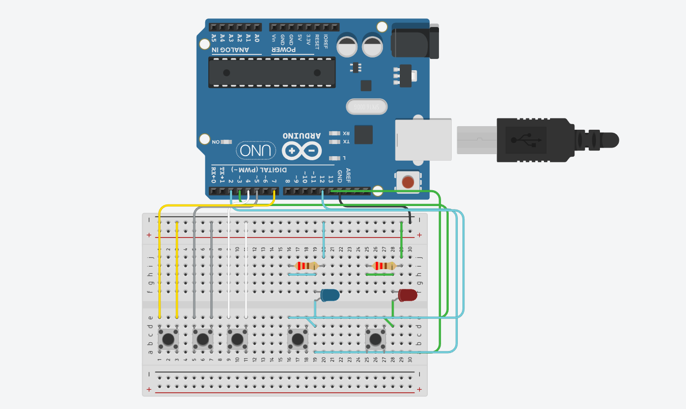

# 早押しボタンシステム
模擬的な早押しボタンが作成できます。
## 動作説明
ボタンは右から順に、
- 赤のLEDに対応する早押しボタン
- 青のLEDに対応する早押しボタン
- 正解ボタン
- 誤答ボタン
- 次の問題に進むボタン
となっています。
右から2つのどちらかのボタンを押すと、右上のLEDが点灯します。
どちらかのLEDが点灯している間は、もう片方のボタンを押しても反応しません。
LEDの点灯中に正解ボタンを押すと正解数、誤答ボタンを押すと誤答数が、
点灯中のLEDに対応しているプレイヤーに1増えます。
次の問題に進む（一番左）ボタンを押すと，
赤のプレイヤーと青のプレイヤーの正答数と誤答数が表示されます。

